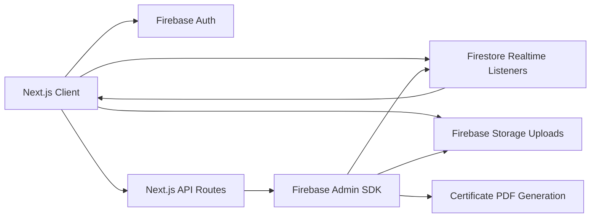
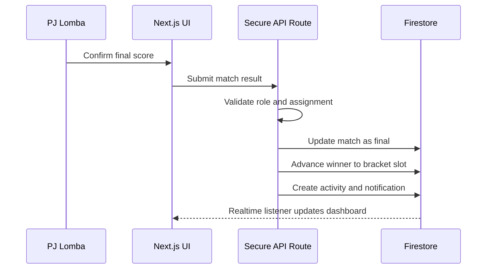
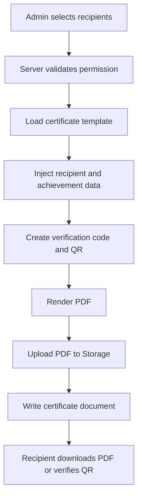

# MELATI CHAMPIONSHIP SERIES 1 System Blueprint

Reference concept: [MCS 1 command-center dashboard](../artifacts/concepts/mcs1-command-center-concept.png)

## Product Positioning

MELATI CHAMPIONSHIP SERIES 1, or MCS 1, should feel like a professional event operating system for a school championship, not a school administration portal. The core impression is a live competition control room: fast to scan, operational, energetic, structured, and ready for people who are moving between venue areas while the event is running.

Primary users:

- Super Admin
- Ketua Pelaksana
- Wakil
- PJ Lomba
- Humas
- Dokumentasi
- Staff and panitia
- External students, participants, and visitors

Core promise:

- Monitor live matches and event flow.
- Update scores and brackets in real time.
- Coordinate divisions, tasks, attendance, announcements, and media.
- Publish event highlights and certificates with clear verification.

## UI/UX Direction

### Visual Language

Main style: modern sports event operating system.

The visual design should borrow from tournament dashboards, esports broadcast control rooms, and sports scoreboard systems. It should avoid AI-tool visuals, crypto dashboards, fintech cards, cyberpunk neon, random glass panels, and excessive gradients.

Design keywords:

- Competitive
- Operational
- Scoreboard-first
- Dense but readable
- Youthful without looking childish
- Premium without looking like a startup landing page

### Color System

Use a dark, sports-broadcast foundation with restrained accents.

| Token | Hex | Usage |
| --- | --- | --- |
| `background` | `#090D12` | App body, page background |
| `surface` | `#111821` | Sidebar, panels |
| `surfaceRaised` | `#18212C` | Important cards, active panels |
| `border` | `#2B3542` | Panel lines, dividers |
| `textPrimary` | `#F4F7FA` | Main text |
| `textSecondary` | `#AAB4C0` | Metadata, labels |
| `textMuted` | `#6F7B88` | Disabled/supporting text |
| `redPrimary` | `#B91C2B` | Active state, live status, primary CTA |
| `redDeep` | `#7F111E` | Strong score/state emphasis |
| `goldSoft` | `#D6AA4F` | Winner states, trophies, highlights |
| `greenLive` | `#2FBF71` | Confirmed success/live health |
| `blueInfo` | `#3B82B6` | Secondary info only |

Rules:

- Keep red and gold as accents, not full-page washes.
- Use dark navy and charcoal as layered surfaces.
- Use semantic colors sparingly for status clarity.
- Avoid purple-blue gradients, neon outlines, glow-heavy active states, and glass blur.

### Typography

Recommended stack:

- Display: `Bebas Neue`, `Anton`, or a similar condensed sports display face.
- Interface heading: `Sora`.
- Body and controls: `Inter` or `Manrope`.

Usage:

- Score numbers should be large, condensed, and scoreboard-like.
- Dashboard panel headings should be uppercase or tight title case with strong weight.
- Body copy should remain practical and compact.
- Avoid decorative text treatments that reduce scan speed.

### Layout Model

Desktop shell:

- Left sidebar: 240-260px, dark solid surface, compact navigation.
- Top navbar: 60-68px, event status, search/quick filter, role switch area, user menu.
- Main content: 12-column operational grid.
- Hero zone: live match scoreboard panel across the top content width.
- Secondary zone: schedule, announcements, activity, and media in balanced columns.

Mobile shell:

- Sidebar becomes a sheet drawer.
- Bottom quick actions expose dashboard, live match, attendance scan, announcements, and profile.
- Score update flows open as bottom sheets.
- Tables collapse into row cards with pinned action buttons.
- Critical event status remains sticky at the top.

### Navigation System

Primary admin navigation:

- Dashboard
- Live Matches
- Competitions
- Brackets
- Participants
- Panitia
- Attendance
- Announcements
- Media Center
- Certificates
- Analytics
- Settings

Navigation behavior:

- Use icons with text on desktop.
- Use compact text labels and familiar symbols on mobile.
- Active state should be a red left rail or solid dark raised row, not glow.
- Group operations with dividers: Event, Competition, Operations, Publishing, System.

### Dashboard Home Hierarchy

The dashboard home is the Super Admin command center.

1. Live Match Hero
   - Largest first-screen element.
   - Shows currently active matches, sport, venue, timer/status, teams/participants, score, and quick action.
   - Uses scoreboard rhythm: team A, score A, status center, score B, team B.

2. Top Statistics
   - Total Matches
   - Active Competitions
   - Total Participants
   - Total Panitia
   - Live Matches

3. Today's Schedule
   - Timeline view with time, venue, sport/category, match title, responsible PJ, and status.

4. Announcements
   - Internal broadcast stream.
   - Priority labels: urgent, operational, public, media.

5. Panitia Activity
   - Recent updates from divisions, score changes, attendance scans, media uploads, and task completion.

6. Media Highlight
   - Latest photos/videos from Dokumentasi and Humas.
   - Compact thumbnails with category, uploader, and approval state.

### Core Component Structure

| Component | Purpose | Design Behavior |
| --- | --- | --- |
| `AppShell` | Sidebar, topbar, content frame | Stable app skeleton, no nested cards |
| `SidebarNav` | Main route navigation | Compact rows, subtle active state |
| `EventStatusBar` | Current event health | Live indicator, date, venue, alerts |
| `StatCard` | Top metrics | Small, dense, numeric, strong label |
| `LiveScoreboard` | Active match hero | Bold score, clear winner/status, quick update |
| `ScheduleTimeline` | Daily operations | Timeline rows, venue chips, status marks |
| `AnnouncementPanel` | Broadcasts | Priority color, author, target audience |
| `ActivityFeed` | Audit-like recent activity | Human-readable operational log |
| `MediaStrip` | Latest uploads | Thumbnail rail, category filters |
| `DataTable` | Participants/matches/users | Dense desktop table, mobile list variant |
| `ScoreUpdateSheet` | PJ score editing | Large tap targets, confirm flow |
| `QRCodeScannerSheet` | Attendance scanning | Camera state, manual fallback, result state |

### Role-Specific UX

Super Admin:

- Full event command center.
- Can manage users, roles, tournaments, competitions, settings, and visibility.
- Sees all live matches, audit activity, analytics, and operational alerts.

Ketua and Wakil:

- Event monitoring and operational approvals.
- Can view most modules and manage announcements, schedules, tasks, attendance, and division progress.

PJ Lomba:

- Focused competition workspace.
- Fast score update, bracket progression, participant check-in, match status updates.

Dokumentasi:

- Media upload, categorization, highlight selection, storage status.
- Can mark media as internal, public, highlight, aftermovie asset.

Humas:

- Public announcements, publication queue, approved media, visitor-facing updates.

Staff:

- Assigned tasks, attendance, schedule, announcements, limited match/support views.

### Responsive Strategy

Mobile priorities:

- Score updates within 2-3 taps.
- Attendance scan from sticky quick action.
- Today's assignments and announcements first.
- Large tap targets, minimum 44px height.
- Sticky save/confirm areas for forms.
- Tables become stacked rows with the most important action pinned.

Tablet priorities:

- Preserve sidebar if width allows.
- Use two-column dashboard.
- Keep live scoreboard dominant.

Desktop priorities:

- High-density monitoring.
- More simultaneous panels visible.
- Data tables and bracket views get full width.

## Backend Architecture

### Stack

- Frontend: Next.js
- Auth: Firebase Auth
- Database: Firestore
- Storage: Firebase Storage
- Hosting: Vercel
- Privileged server logic: Next.js Route Handlers or Server Actions with Firebase Admin SDK
- Optional event triggers: Firebase Cloud Functions for asynchronous jobs

Use the Firebase client SDK for real-time reads that the signed-in user is allowed to access. Use Firebase Admin SDK only on trusted server routes for role assignment, certificate generation, QR validation, automatic bracket progression, and any write that must not trust client input.

### High-Level Flow



### Auth and Role Model

Roles:

- `super_admin`
- `ketua`
- `wakil`
- `pj_lomba`
- `dokumentasi`
- `humas`
- `staff`

Use Firebase custom claims as the security source of truth:

```ts
{
  uid: "auth_user_id",
  role: "super_admin",
  tournamentIds: ["mcs-1"],
  divisionIds: ["competition", "media"],
  competitionIds: ["futsal-putra"]
}
```

Mirror the role in `users/{uid}` for UI display and filtering, but do not trust the user document alone for rules.

Authorization layers:

- Route protection: Next middleware or layout guard checks session cookie or ID token.
- UI visibility: role-aware navigation and action buttons.
- Firestore rules: enforce read/write permissions.
- Server validation: admin-only writes go through API routes using Firebase Admin SDK.

## Firestore Data Model

Use top-level collections with `tournamentId` fields for scalable querying. For high-volume logs, prefer subcollections under the parent document.

### 1. `users`

Purpose: internal account profiles, role display, division assignment, and operational identity.

Example:

```ts
users/{uid} = {
  displayName: "Raka Pratama",
  email: "raka@example.com",
  role: "pj_lomba",
  status: "active",
  tournamentIds: ["mcs-1"],
  divisionIds: ["competition"],
  assignedCompetitionIds: ["futsal-putra"],
  phone: "08xxxxxxxxxx",
  photoURL: null,
  lastActiveAt: Timestamp,
  createdAt: Timestamp,
  updatedAt: Timestamp
}
```

Relationships:

- Referenced by `tasks.assigneeIds`, `announcements.createdBy`, `media.uploadedBy`, `matches.updatedBy`.

Realtime:

- Listen to the current user document.
- Admin screens can query users by role/division with pagination.

Indexes:

- `role ASC, status ASC`
- `divisionIds ARRAY_CONTAINS, status ASC`
- `lastActiveAt DESC`

Scalability:

- Keep auth-sensitive decisions in custom claims.
- Avoid placing large activity arrays inside user documents.

### 2. `tournaments`

Purpose: event-level configuration for MCS 1 and future championship editions.

Example:

```ts
tournaments/{tournamentId} = {
  name: "Melati Championship Series 1",
  shortName: "MCS 1",
  host: "SMKN 20 Jakarta",
  status: "live",
  startsAt: Timestamp,
  endsAt: Timestamp,
  timezone: "Asia/Jakarta",
  visibility: "internal_public",
  branding: {
    primaryColor: "#B91C2B",
    secondaryColor: "#D6AA4F",
    logoPath: "branding/mcs-1/logo.png"
  },
  createdAt: Timestamp,
  updatedAt: Timestamp
}
```

Relationships:

- Every operational collection stores `tournamentId`.

Realtime:

- Dashboard listens to the active tournament document for event status changes.

Indexes:

- `status ASC, startsAt DESC`

Scalability:

- Enables future MCS editions without duplicating collections.

### 3. `matches`

Purpose: live match state, score, schedule linkage, status, and bracket progression.

Example:

```ts
matches/{matchId} = {
  tournamentId: "mcs-1",
  competitionId: "futsal-putra",
  bracketId: "bracket-futsal-putra",
  scheduleId: "sched-001",
  sportType: "futsal",
  round: "quarter_final",
  matchNumber: 7,
  venue: "Lapangan Utama",
  participantA: {
    id: "team-x",
    name: "XI TKJ 1",
    seed: 2
  },
  participantB: {
    id: "team-y",
    name: "XI AKL 2",
    seed: 7
  },
  score: {
    a: 2,
    b: 1,
    sets: []
  },
  status: "live",
  winnerParticipantId: null,
  startsAt: Timestamp,
  endedAt: null,
  updatedBy: "uid",
  updatedAt: Timestamp,
  createdAt: Timestamp
}
```

Field notes:

- `sportType` supports `futsal`, `badminton`, `basket`, `volley`, `mobile_legends`, and `arts`.
- `score.sets` supports set-based sports and Mobile Legends game maps.
- `status` should be one of `scheduled`, `check_in`, `live`, `paused`, `final`, `cancelled`, `walkover`.

Relationships:

- Links to `brackets`, `schedules`, `users`, and participant/team records.

Realtime:

- Dashboard listens only to `status IN ["live", "paused", "check_in"]`.
- Match detail page listens to a single match document.

Indexes:

- `tournamentId ASC, status ASC, startsAt ASC`
- `tournamentId ASC, competitionId ASC, round ASC, matchNumber ASC`
- `tournamentId ASC, sportType ASC, startsAt ASC`

Scalability:

- Store score update history in `matches/{matchId}/scoreEvents/{eventId}` instead of an array.
- Use server-side progression when a match becomes `final`.

### 4. `brackets`

Purpose: tournament bracket definition, slot mapping, and automatic winner progression.

Example:

```ts
brackets/{bracketId} = {
  tournamentId: "mcs-1",
  competitionId: "futsal-putra",
  format: "single_elimination",
  rounds: ["round_of_16", "quarter_final", "semi_final", "final"],
  status: "active",
  slots: {
    "r16-m1-a": { participantId: "team-a", sourceMatchId: null },
    "r16-m1-b": { participantId: "team-b", sourceMatchId: null },
    "qf-m1-a": { participantId: null, sourceMatchId: "match-r16-1" }
  },
  championParticipantId: null,
  createdAt: Timestamp,
  updatedAt: Timestamp
}
```

Relationships:

- `matches.bracketId` points here.
- Slot `sourceMatchId` points to previous match winners.

Realtime:

- Bracket page listens to one bracket document plus visible matches for the competition.

Indexes:

- `tournamentId ASC, competitionId ASC`

Scalability:

- For very large brackets, move slots to `brackets/{bracketId}/slots/{slotId}`.
- For MCS 1, a single bracket document per competition is acceptable.

### 5. `announcements`

Purpose: internal broadcasts, public updates, and urgent operational notices.

Example:

```ts
announcements/{announcementId} = {
  tournamentId: "mcs-1",
  title: "Futsal quarter final moved to 13:30",
  body: "PJ Futsal please update teams and referee standby.",
  priority: "urgent",
  audience: ["internal", "pj_lomba"],
  channel: "dashboard",
  visibility: "internal",
  createdBy: "uid",
  pinnedUntil: Timestamp,
  publishedAt: Timestamp,
  createdAt: Timestamp,
  updatedAt: Timestamp
}
```

Relationships:

- References `users.createdBy`.
- Can generate `notifications`.

Realtime:

- Dashboard listens to latest pinned and urgent announcements.

Indexes:

- `tournamentId ASC, visibility ASC, publishedAt DESC`
- `tournamentId ASC, priority ASC, publishedAt DESC`

Scalability:

- Keep body concise.
- Use notification fan-out for per-user read states.

### 6. `attendance`

Purpose: QR-based check-in and check-out records for panitia, staff, and participants.

Example:

```ts
attendance/{attendanceId} = {
  tournamentId: "mcs-1",
  sessionId: "day-1-morning",
  personType: "panitia",
  personId: "uid-or-participant-id",
  displayName: "Nadia Putri",
  divisionId: "media",
  status: "checked_in",
  checkInAt: Timestamp,
  checkOutAt: null,
  checkInBy: "uid",
  checkOutBy: null,
  method: "qr",
  qrNonceId: "nonce-123",
  location: "Main Gate",
  createdAt: Timestamp,
  updatedAt: Timestamp
}
```

Relationships:

- Person can be a `users` document or participant/team member document.
- `divisionId` supports panitia reporting.

Realtime:

- Attendance dashboard listens to current session summary.
- User profile listens to the user's current attendance state.

Indexes:

- `tournamentId ASC, sessionId ASC, personType ASC`
- `tournamentId ASC, divisionId ASC, checkInAt DESC`
- `personId ASC, sessionId ASC`

Scalability:

- Validate QR scan on the server.
- Prevent duplicate check-ins with deterministic IDs like `{sessionId}_{personId}`.

### 7. `divisions`

Purpose: panitia organization, division ownership, and role grouping.

Example:

```ts
divisions/{divisionId} = {
  tournamentId: "mcs-1",
  name: "Dokumentasi",
  code: "media",
  leadUserId: "uid",
  memberIds: ["uid1", "uid2"],
  responsibilities: ["Photo coverage", "Video capture", "Asset upload"],
  status: "active",
  createdAt: Timestamp,
  updatedAt: Timestamp
}
```

Relationships:

- Used by `users`, `tasks`, `attendance`, and analytics.

Realtime:

- Division detail listens to one division and its active tasks.

Indexes:

- `tournamentId ASC, code ASC`
- `tournamentId ASC, status ASC`

Scalability:

- For 55+ panitia, member arrays are acceptable.
- If membership grows significantly, use `divisions/{divisionId}/members`.

### 8. `tasks`

Purpose: operational task assignment and division monitoring.

Example:

```ts
tasks/{taskId} = {
  tournamentId: "mcs-1",
  title: "Upload final futsal highlight reel",
  description: "Select 8-12 best clips and mark as highlight.",
  divisionId: "media",
  assigneeIds: ["uid1"],
  priority: "high",
  status: "in_progress",
  dueAt: Timestamp,
  relatedMatchId: "match-001",
  createdBy: "uid",
  completedAt: null,
  createdAt: Timestamp,
  updatedAt: Timestamp
}
```

Relationships:

- Links to divisions, users, matches, and media.

Realtime:

- User task list listens to assigned open tasks.
- Admin task board listens by division and status.

Indexes:

- `tournamentId ASC, status ASC, dueAt ASC`
- `assigneeIds ARRAY_CONTAINS, status ASC, dueAt ASC`
- `divisionId ASC, status ASC, dueAt ASC`

Scalability:

- Store comments in `tasks/{taskId}/comments`.
- Avoid putting long comment histories in the task document.

### 9. `media`

Purpose: Firebase Storage metadata for photos, videos, highlights, and aftermovie assets.

Example:

```ts
media/{mediaId} = {
  tournamentId: "mcs-1",
  type: "image",
  category: "highlight",
  title: "Opening ceremony crowd",
  storagePath: "mcs-1/media/highlights/img-001.jpg",
  downloadURL: "https://...",
  thumbnailPath: "mcs-1/media/thumbs/img-001.jpg",
  relatedMatchId: null,
  uploadedBy: "uid",
  approvalStatus: "approved",
  visibility: "public",
  tags: ["opening", "anniversary"],
  createdAt: Timestamp,
  updatedAt: Timestamp
}
```

Relationships:

- References matches, competitions, users, and public pages.

Realtime:

- Media center listens to latest approved uploads.
- Dokumentasi workspace listens to uploads by approval state.

Indexes:

- `tournamentId ASC, category ASC, createdAt DESC`
- `tournamentId ASC, approvalStatus ASC, createdAt DESC`
- `relatedMatchId ASC, createdAt DESC`

Scalability:

- Store actual files in Firebase Storage, not Firestore.
- Generate thumbnails through server processing or Cloud Functions.

### 10. `certificates`

Purpose: generated certificate records, PDF file paths, and verification QR codes.

Example:

```ts
certificates/{certificateId} = {
  tournamentId: "mcs-1",
  recipientType: "participant",
  recipientId: "participant-001",
  recipientName: "Dewi Anggraini",
  certificateType: "winner",
  competitionId: "badminton-putri",
  achievement: "Juara 1",
  verificationCode: "MCS1-BDM-9X2A7C",
  pdfStoragePath: "mcs-1/certificates/MCS1-BDM-9X2A7C.pdf",
  status: "generated",
  generatedBy: "uid",
  generatedAt: Timestamp,
  createdAt: Timestamp,
  updatedAt: Timestamp
}
```

Relationships:

- References participants/users, competitions, tournaments, and Storage.

Realtime:

- Certificate admin listens to generation status.
- Recipient page fetches by verification code.

Indexes:

- `verificationCode ASC`
- `tournamentId ASC, recipientId ASC`
- `tournamentId ASC, competitionId ASC, certificateType ASC`

Scalability:

- Generate PDFs server-side.
- Store immutable certificate files in Storage.
- Keep verification pages read-only and public-safe.

### 11. `analytics`

Purpose: aggregated dashboard numbers and operational metrics.

Example:

```ts
analytics/{analyticsId} = {
  tournamentId: "mcs-1",
  scope: "daily",
  dateKey: "2026-06-01",
  totals: {
    matches: 42,
    liveMatches: 3,
    participants: 384,
    panitia: 58,
    attendanceCheckedIn: 49,
    mediaUploads: 126
  },
  updatedAt: Timestamp
}
```

Relationships:

- Derived from matches, attendance, users, media, tasks, and certificates.

Realtime:

- Dashboard can listen to the current daily analytics document instead of querying every collection.

Indexes:

- `tournamentId ASC, scope ASC, dateKey DESC`

Scalability:

- Use incremental counters or scheduled aggregation.
- Do not calculate large totals on every dashboard render.

### 12. `schedules`

Purpose: event timetable for matches, ceremonies, technical meetings, media slots, and operational blocks.

Example:

```ts
schedules/{scheduleId} = {
  tournamentId: "mcs-1",
  title: "Futsal Quarter Final 1",
  type: "match",
  sportType: "futsal",
  competitionId: "futsal-putra",
  matchId: "match-001",
  venue: "Lapangan Utama",
  startsAt: Timestamp,
  endsAt: Timestamp,
  status: "scheduled",
  responsibleUserIds: ["uid-pj"],
  notes: "Prepare referee and scoreboard.",
  createdAt: Timestamp,
  updatedAt: Timestamp
}
```

Relationships:

- Links to matches and users.

Realtime:

- Today's schedule listens by date range.

Indexes:

- `tournamentId ASC, startsAt ASC`
- `tournamentId ASC, type ASC, startsAt ASC`
- `responsibleUserIds ARRAY_CONTAINS, startsAt ASC`

Scalability:

- Query bounded date ranges only.
- Archive old schedules by tournament edition.

### 13. `notifications`

Purpose: per-user alerts, action prompts, read states, and targeted broadcasts.

Example:

```ts
notifications/{notificationId} = {
  tournamentId: "mcs-1",
  recipientUserId: "uid",
  type: "task_assigned",
  title: "New task assigned",
  body: "Upload final futsal highlight reel.",
  link: "/dashboard/tasks/task-001",
  readAt: null,
  createdAt: Timestamp
}
```

Relationships:

- Generated from tasks, announcements, matches, certificates, and attendance.

Realtime:

- App shell listens to unread notifications for the current user.

Indexes:

- `recipientUserId ASC, readAt ASC, createdAt DESC`
- `tournamentId ASC, createdAt DESC`

Scalability:

- Keep notifications small.
- Use batched writes for broadcast fan-out.

## Match and Bracket Progression

When a PJ finalizes a match:

1. Client submits final score to a privileged API route.
2. Server verifies role, assigned competition, and match status.
3. Server writes match `status: "final"` and `winnerParticipantId`.
4. Server reads the bracket slot mapping.
5. Server updates the next match participant slot.
6. Server writes a score event and activity entry.
7. Firestore listeners update dashboard, bracket, and schedule UI.



## Realtime Strategy

Use small, intentional listeners:

- Dashboard live matches: `matches` where `tournamentId == active` and `status in ["live", "paused", "check_in"]`.
- Today's schedule: `schedules` where `startsAt` is within today's bounds.
- Announcements: latest pinned or urgent items.
- Current user notifications: unread notifications only.
- Match detail: single match document plus score event subcollection.
- Bracket page: one bracket document plus matches for one competition.

Rules:

- Never subscribe to entire high-volume collections.
- Unsubscribe on route change and tab change.
- Prefer server aggregation for metrics.
- Keep Zustand for UI state and selected filters; Firestore remains source of truth.

## QR Attendance Architecture

QR payload:

```json
{
  "sessionId": "day-1-morning",
  "personId": "uid-or-participant-id",
  "personType": "panitia",
  "nonce": "signed-short-token",
  "expiresAt": 1780282800000
}
```

Validation flow:

1. Scanner opens from mobile quick action.
2. Client reads QR payload.
3. Client sends payload to `/api/attendance/scan`.
4. Server validates token, expiration, session, person, role, and duplicate state.
5. Server writes `attendance/{sessionId}_{personId}`.
6. Client shows success, duplicate, expired, or invalid state.

Use check-in and check-out state transitions:

- `not_checked_in`
- `checked_in`
- `checked_out`
- `late`
- `excused`

## Media Center Architecture

Upload flow:

1. Client requests an upload target or uses restricted Firebase Storage path.
2. File uploads to `mcs-1/media/{category}/{generatedId}`.
3. Metadata document is created in `media`.
4. Optional thumbnail job creates `thumbnailPath`.
5. Humas or Super Admin approves public visibility.

Storage paths:

```txt
mcs-1/media/raw/{mediaId}
mcs-1/media/thumbs/{mediaId}.jpg
mcs-1/media/highlights/{mediaId}
mcs-1/certificates/{verificationCode}.pdf
mcs-1/branding/logo.png
```

## Certificate Architecture

Generation flow:



Verification:

- Public route: `/verify/certificate/{verificationCode}`
- Query `certificates` by `verificationCode`
- Display recipient name, competition, achievement, tournament, and generation timestamp.
- Do not expose private user data.

## Firestore Security Rule Concepts

Use custom claims for roles and tournament access.

```js
rules_version = '2';
service cloud.firestore {
  match /databases/{database}/documents {
    function signedIn() {
      return request.auth != null;
    }

    function role() {
      return request.auth.token.role;
    }

    function isSuperAdmin() {
      return signedIn() && role() == "super_admin";
    }

    function hasAnyRole(roles) {
      return signedIn() && role() in roles;
    }

    function canAccessTournament(tournamentId) {
      return signedIn() && tournamentId in request.auth.token.tournamentIds;
    }

    match /users/{uid} {
      allow read: if signedIn() && (request.auth.uid == uid || hasAnyRole(["super_admin", "ketua", "wakil"]));
      allow create, update, delete: if isSuperAdmin();
    }

    match /tournaments/{tournamentId} {
      allow read: if canAccessTournament(tournamentId);
      allow write: if isSuperAdmin();
    }

    match /matches/{matchId} {
      allow read: if signedIn() && canAccessTournament(resource.data.tournamentId);
      allow create, update, delete: if hasAnyRole(["super_admin", "ketua", "wakil", "pj_lomba"]);
    }

    match /announcements/{announcementId} {
      allow read: if signedIn() && canAccessTournament(resource.data.tournamentId);
      allow create, update, delete: if hasAnyRole(["super_admin", "ketua", "wakil", "humas"]);
    }

    match /media/{mediaId} {
      allow read: if signedIn() && canAccessTournament(resource.data.tournamentId);
      allow create: if hasAnyRole(["super_admin", "dokumentasi", "humas"]);
      allow update, delete: if hasAnyRole(["super_admin", "humas"]);
    }

    match /certificates/{certificateId} {
      allow read: if signedIn() && canAccessTournament(resource.data.tournamentId);
      allow write: if false;
    }
  }
}
```

Important:

- Rules above are conceptual. Tighten field validation before production.
- Sensitive writes such as final score confirmation, role assignment, QR attendance validation, certificate generation, and public approval should go through trusted server routes.

## Recommended Project Structure

```txt
src/
  app/
    (public)/
      page.tsx
      verify/certificate/[code]/page.tsx
    (dashboard)/
      dashboard/page.tsx
      matches/page.tsx
      matches/[matchId]/page.tsx
      brackets/page.tsx
      attendance/page.tsx
      media/page.tsx
      certificates/page.tsx
      settings/page.tsx
    api/
      auth/session/route.ts
      attendance/scan/route.ts
      matches/[matchId]/finalize/route.ts
      certificates/generate/route.ts
      media/approve/route.ts
  components/
    app-shell/
    dashboard/
    matches/
    brackets/
    attendance/
    media/
    certificates/
    ui/
  features/
    auth/
    users/
    tournaments/
    matches/
    brackets/
    announcements/
    attendance/
    divisions/
    tasks/
    media/
    certificates/
    analytics/
    schedules/
    notifications/
  hooks/
    use-current-user.ts
    use-live-matches.ts
    use-today-schedule.ts
    use-announcements.ts
    use-notifications.ts
  lib/
    firebase/
      client.ts
      admin.ts
      auth.ts
      firestore.ts
      storage.ts
    permissions/
      roles.ts
      guards.ts
    utils/
  services/
    auth.service.ts
    users.service.ts
    matches.service.ts
    announcements.service.ts
    media.service.ts
    attendance.service.ts
    certificates.service.ts
  stores/
    auth-store.ts
    dashboard-store.ts
    live-score-store.ts
    ui-store.ts
  types/
    firestore.ts
    roles.ts
    tournament.ts
    match.ts
    attendance.ts
```

## Service Architecture

`auth.service.ts`

- Sign in and sign out.
- Session cookie exchange.
- Current user profile fetch.
- Role refresh after custom claim changes.

`matches.service.ts`

- Subscribe to live matches.
- Fetch match detail.
- Submit score draft.
- Finalize match via secure API route.

`announcements.service.ts`

- Subscribe to urgent and pinned announcements.
- Create announcement.
- Publish/unpublish announcement.
- Generate notifications.

`media.service.ts`

- Upload file to Storage.
- Create metadata.
- Approve/reject media.
- Fetch highlight rail.

`attendance.service.ts`

- Scan QR through secure API route.
- Subscribe to session attendance.
- Fetch division attendance summary.

`users.service.ts`

- Query users by role/division.
- Update profile fields.
- Role assignment through admin-only API.

`certificates.service.ts`

- Request certificate generation.
- Fetch certificate status.
- Verify by code.

## Zustand State Management

Use Zustand for UI and short-lived app state, not as a replacement for Firestore.

Stores:

```ts
authStore = {
  uid,
  role,
  profile,
  isLoading,
  setSession,
  clearSession
}

dashboardStore = {
  activeTournamentId,
  selectedDate,
  selectedCompetitionId,
  setSelectedDate,
  setSelectedCompetitionId
}

liveScoreStore = {
  focusedMatchId,
  optimisticScores,
  setFocusedMatch,
  setOptimisticScore,
  clearOptimisticScore
}

uiStore = {
  sidebarOpen,
  scoreSheetOpen,
  scannerOpen,
  commandPaletteOpen,
  openSheet,
  closeSheet
}
```

Best practices:

- Keep server data in Firestore hooks.
- Keep selected filters, open panels, optimistic edits, and scanner state in Zustand.
- Reset route-specific state on navigation.
- Do not duplicate large Firestore query results into global stores.

## Performance Considerations

Firestore:

- Query by `tournamentId` first.
- Use pagination for users, media, certificates, and attendance history.
- Use small real-time listener scopes.
- Use aggregate documents for dashboard totals.
- Avoid array fields for high-frequency event logs.

Rendering:

- Split dashboard panels into focused components.
- Use memoized computed display rows for tables.
- Virtualize large tables if needed.
- Keep image thumbnails sized and compressed.
- Use responsive image loading for media center.

Storage:

- Separate raw uploads from thumbnails.
- Restrict write paths by role.
- Use predictable folder hierarchy by tournament.

Realtime:

- Turn off listeners when panels are hidden.
- Prefer one document listener for match detail instead of broad match queries.
- Use server timestamps for consistent ordering.

## Production Readiness Checklist

- Firebase custom claims configured for every role.
- Admin-only role assignment route.
- Firestore rules with field validation.
- Storage rules matching media and certificate paths.
- Server-side match finalization and bracket progression.
- QR attendance validation route with nonce expiry.
- Certificate generation route with QR verification.
- Composite indexes deployed.
- Audit trail for sensitive actions.
- Error and loading states for every real-time panel.
- Mobile score update and attendance scan tested on real devices.
